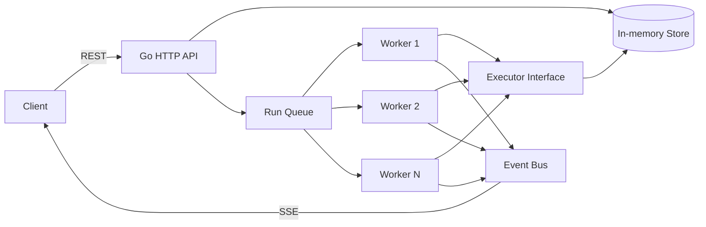

# AgentMesh

**Distributed AI Agent Control Plane written in Go.**

AgentMesh is a portfolio-grade control-plane project for registering agents, submitting asynchronous runs, processing work through a concurrent worker pool, and streaming run lifecycle events to clients.

> **Current stage: v0.1 MVP.** The runtime intentionally uses an in-memory store and deterministic demo executor so the control-plane core can be tested without external infrastructure. PostgreSQL, NATS JetStream, Redis, MCP, and real LLM providers are planned as incremental architectural upgrades.

## Why this project exists

The goal is to explore the engineering behind agent infrastructure rather than build another chatbot: concurrency, queues, lifecycle state, event streams, graceful shutdown, durable execution, observability, and distributed systems.

## Architecture



The executor is an interface. The current `DemoExecutor` is deliberately deterministic; future providers can call OpenAI-compatible APIs, local inference servers, or MCP-enabled runtimes without changing the HTTP layer.

## Features

- Go standard-library HTTP server (`net/http`)
- Agent registration and lookup
- Asynchronous run submission
- Configurable concurrent worker pool
- Explicit run state machine: `queued → running → succeeded/failed`
- Server-Sent Events (SSE) for lifecycle events
- Graceful shutdown
- Environment-based configuration
- Unit/API tests
- Race-detector-friendly synchronization
- Multi-stage Docker build
- GitHub Actions CI
- Zero third-party Go dependencies in v0.1

## API

| Method | Endpoint | Purpose |
| --- | --- | --- |
| `GET` | `/healthz` | Liveness |
| `GET` | `/readyz` | Readiness |
| `POST` | `/api/v1/agents` | Create an agent |
| `GET` | `/api/v1/agents` | List agents |
| `GET` | `/api/v1/agents/{id}` | Get an agent |
| `POST` | `/api/v1/runs` | Submit a run |
| `GET` | `/api/v1/runs` | List runs |
| `GET` | `/api/v1/runs/{id}` | Get run status/result |
| `GET` | `/api/v1/runs/{id}/events` | Stream lifecycle events via SSE |

## Run locally

Requires Go 1.23+.

```bash
go run ./cmd/agentmesh
```

Then:

```bash
curl http://localhost:8080/healthz
```

### Create an agent

```bash
curl -X POST http://localhost:8080/api/v1/agents \
  -H "Content-Type: application/json" \
  -d '{"name":"Researcher","system_prompt":"Be concise and evidence-oriented."}'
```

### Submit a run

```bash
curl -X POST http://localhost:8080/api/v1/runs \
  -H "Content-Type: application/json" \
  -d '{"agent_id":"agt_REPLACE_ME","input":"Explain control planes."}'
```

### Windows PowerShell smoke test

With the server running in one terminal:

```powershell
.\scripts\smoke.ps1
```

## Configuration

| Variable | Default | Meaning |
| --- | --- | --- |
| `AGENTMESH_ADDR` | `:8080` | HTTP bind address |
| `AGENTMESH_WORKERS` | `4` | Worker goroutines |
| `AGENTMESH_QUEUE_SIZE` | `128` | In-memory run queue capacity |
| `AGENTMESH_EXECUTION_DELAY` | `750ms` | Demo executor latency |
| `AGENTMESH_SHUTDOWN_TIMEOUT` | `10s` | HTTP graceful-shutdown timeout |

## Test

```bash
go test ./...
go test -race ./...
go vet ./...
```

## Docker

```bash
docker compose up --build
```

## Project structure

```text
cmd/agentmesh/          application entrypoint
internal/config/        environment configuration
internal/domain/        core domain models
internal/engine/        queue, workers and executor abstraction
internal/events/        in-process event bus
internal/httpapi/       REST + SSE transport
internal/store/         thread-safe in-memory repository
scripts/                PowerShell developer utilities
docs/                   roadmap and architecture notes
.github/workflows/      CI pipeline
```

## Next milestones

The next iteration replaces process-local infrastructure with durable/distributed components:

1. PostgreSQL for agents and run state
2. NATS JetStream for durable work delivery
3. Redis for caching and distributed coordination
4. Retry/backoff, idempotency and dead-letter handling
5. Real LLM provider abstraction
6. MCP tool gateway
7. OpenTelemetry
8. Next.js operations dashboard
9. Kubernetes/Helm deployment

See [`docs/roadmap.md`](docs/roadmap.md).

## Design principles

- Keep the control plane independent of any single LLM vendor.
- Make concurrency explicit and observable.
- Prefer interfaces at infrastructure boundaries.
- Add distributed infrastructure only when the local behavior is testable.
- Treat failure, retry, cancellation and idempotency as first-class design concerns.

## License

MIT
