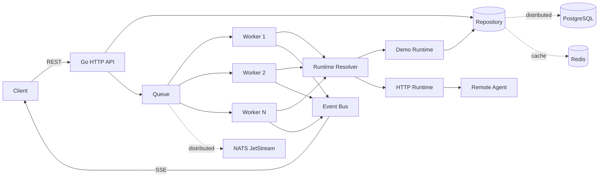

# AgentMesh

[](https://github.com/thiagomontozo/agentmesh/actions/workflows/ci.yml)
[](LICENSE)


**Distributed AI Agent Control Plane written in Go.**

AgentMesh is a portfolio-grade control-plane project for registering agents, submitting asynchronous runs, processing work through a concurrent worker pool, and streaming run lifecycle events to clients.

> **Current stage: v0.2.** AgentMesh supports a zero-infrastructure memory mode, a durable distributed mode backed by PostgreSQL, NATS JetStream, and Redis, and language-neutral remote Agents through Agent Protocol V1 over HTTP.

## Why this project exists

The goal is to explore the engineering behind agent infrastructure rather than build another chatbot: concurrency, queues, lifecycle state, event streams, graceful shutdown, durable execution, observability, and distributed systems.

## Architecture



The Engine resolves the already-selected Agent's runtime through a concurrency-safe registry. Legacy Agents and Agents declaring `runtime: "demo"` use the deterministic `DemoExecutor` through an adapter. Agents declaring `runtime: "remote"` and `protocol: "http"` are invoked over Agent Protocol V1 without runtime-specific branching in the Engine.

## Features

- Go standard-library HTTP server (`net/http`)
- Agent registration and lookup
- Remote HTTP Agent execution through Agent Protocol V1
- Asynchronous run submission
- Configurable concurrent worker pool
- Explicit run state machine: `queued → running → succeeded/failed/canceled`
- Server-Sent Events (SSE) for lifecycle events
- Graceful shutdown
- Environment-based configuration
- Unit/API tests
- Race-detector-friendly synchronization
- Multi-stage Docker build
- GitHub Actions CI
- Zero third-party Go dependencies in v0.1
- PostgreSQL persistence and embedded migrations
- NATS JetStream durable run delivery and dead-letter subject
- Redis read-through cache with graceful database fallback
- Idempotent run creation through `Idempotency-Key`
- Configurable retry with exponential backoff
- Configurable per-attempt execution timeout
- Runtime panic isolation at the execution boundary
- Explicit cancellation for queued and running Runs
- Automatic execution-lease renewal for long-running Runs
- Monotonic fencing tokens for stale-worker write protection
- Lease-aware multi-replica recovery for abandoned Runs
- Cross-replica Run events and SSE through NATS pub/sub
- Restart recovery for queued/running work

## API

| Method | Endpoint | Purpose |
| --- | --- | --- |
| `GET` | `/healthz` | Liveness |
| `GET` | `/readyz` | Readiness |
| `POST` | `/api/v1/agents` | Create an agent |
| `GET` | `/api/v1/agents` | List agents |
| `GET` | `/api/v1/agents/{id}` | Get an agent |
| `POST` | `/api/v1/runs` | Submit a run |
| `GET` | `/api/v1/runs` | List runs |
| `GET` | `/api/v1/runs/{id}` | Get run status/result |
| `POST` | `/api/v1/runs/{id}/cancel` | Cancel a queued or running Run |
| `GET` | `/api/v1/runs/{id}/events` | Stream lifecycle events via SSE |

## Run locally

Requires Go 1.23+.

```bash
go run ./cmd/agentmesh
```

Then:

```bash
curl http://localhost:8080/healthz
```

### Create an agent

```bash
curl -X POST http://localhost:8080/api/v1/agents \
  -H "Content-Type: application/json" \
  -d '{"name":"Researcher","system_prompt":"Be concise and evidence-oriented."}'
```

### Submit a run

```bash
curl -X POST http://localhost:8080/api/v1/runs \
  -H "Content-Type: application/json" \
  -H "Idempotency-Key: explain-control-planes-1" \
  -d '{"agent_id":"agt_REPLACE_ME","input":"Explain control planes."}'
```

Reusing the same idempotency key and payload returns the original run with `Idempotency-Replayed: true`. Reusing it with a different payload returns `409 Conflict`.

### Windows PowerShell smoke test

With the server running in one terminal:

```powershell
.\scripts\smoke.ps1
```

## Configuration

| Variable | Default | Meaning |
| --- | --- | --- |
| `AGENTMESH_ADDR` | `:8080` | HTTP bind address |
| `AGENTMESH_MODE` | `memory` | `memory` or `distributed` runtime |
| `AGENTMESH_WORKERS` | `4` | Worker goroutines |
| `AGENTMESH_QUEUE_SIZE` | `128` | In-memory run queue capacity |
| `AGENTMESH_EXECUTION_DELAY` | `750ms` | Demo executor latency |
| `AGENTMESH_ATTEMPT_TIMEOUT` | `30s` | Maximum duration of each execution attempt |
| `AGENTMESH_SHUTDOWN_TIMEOUT` | `10s` | HTTP graceful-shutdown timeout |
| `AGENTMESH_MAX_ATTEMPTS` | `3` | Executor attempts before dead-lettering |
| `AGENTMESH_RETRY_INITIAL_BACKOFF` | `250ms` | Initial retry delay |
| `AGENTMESH_RETRY_MAX_BACKOFF` | `5s` | Maximum exponential retry delay |
| `AGENTMESH_DATABASE_URL` | — | PostgreSQL URL required in distributed mode |
| `AGENTMESH_NATS_URL` | — | NATS URL required in distributed mode |
| `AGENTMESH_REDIS_URL` | — | Redis URL required in distributed mode |
| `AGENTMESH_NATS_ACK_WAIT` | `2m` | JetStream acknowledgement timeout |
| `AGENTMESH_CACHE_TTL` | `30s` | Redis cache lifetime |
| `AGENTMESH_LEASE_TTL` | `5m` | Distributed per-run execution lease |

## Test

```bash
go test ./...
go test -race ./...
go vet ./...
```

Distributed integration tests require the Compose dependencies:

```bash
docker compose up -d --wait postgres nats redis
go test -tags=integration -count=1 ./internal/integration
docker compose down -v
```

## Docker

`docker compose up --build` starts the complete distributed stack. For the lightweight local mode, use `go run ./cmd/agentmesh`.

## Project structure

```text
cmd/agentmesh/          application entrypoint
internal/config/        environment configuration
internal/domain/        core domain models
internal/engine/        queue, workers and executor abstraction
internal/runtime/       runtime request/result contract and legacy adapter
internal/protocol/v1/   language-neutral Agent Protocol V1 wire types
internal/events/        bounded local bus + distributed NATS pub/sub
internal/httpapi/       REST + SSE transport
internal/queue/         memory and NATS JetStream queues
internal/cache/         Redis cache adapter
internal/store/         memory, cached and PostgreSQL repositories
scripts/                PowerShell developer utilities
docs/                   roadmap and architecture notes
.github/workflows/      CI pipeline
```

## Documentation

- [Architecture and delivery guarantees](docs/architecture.md)
- [Agent Protocol V1](docs/agent-protocol-v1.md)
- [External HTTP Agents](docs/external-agents.md)
- [Configuration and operations](docs/configuration.md)
- [API usage and examples](docs/api.md)
- [Troubleshooting](docs/troubleshooting.md)
- [Roadmap](docs/roadmap.md)

## Next milestones

The next iterations add the real agent runtime and production operations:

1. Real LLM provider abstraction
2. MCP tool gateway and tool policies
3. Human approval gates
4. OpenTelemetry and Prometheus
5. Authentication, RBAC and audit log
6. Next.js operations dashboard
7. Kubernetes/Helm deployment

See [`docs/roadmap.md`](docs/roadmap.md).

## Design principles

- Keep the control plane independent of any single LLM vendor.
- Make concurrency explicit and observable.
- Prefer interfaces at infrastructure boundaries.
- Add distributed infrastructure only when the local behavior is testable.
- Treat failure, retry, cancellation and idempotency as first-class design concerns.

## License

MIT
